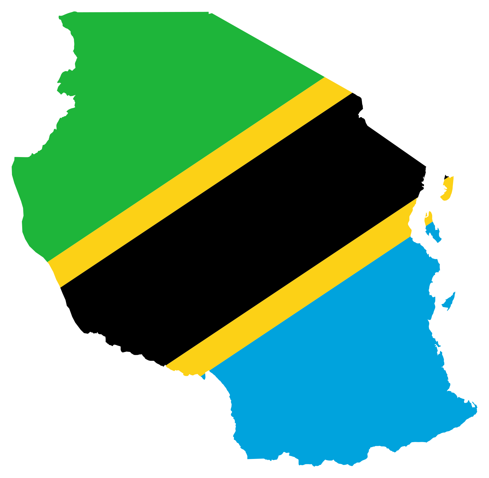

# Tanzania Boundary Search — QGIS Plugin

Type a Tanzanian place name in QGIS's native **Coordinate** field and instantly load its administrative boundary.

### [⬇️ Download TanzaniaBoundarySearch.zip](https://github.com/Heed725/Tanzania-Boundary-Search-Qgis-Plugin/raw/refs/heads/main/TanzaniaBoundarySearch.zip)

### [🛠️ Download BoundaryPluginBuilder.zip](https://github.com/Heed725/Tanzania-Boundary-Search-Qgis-Plugin/raw/refs/heads/main/BoundaryPluginBuilder.zip)

## What it does

The plugin adds Tanzania boundary autocomplete to the existing Coordinate field in the QGIS status bar. Start typing a country, region, district, or ward name, choose a suggestion, and the matching boundary is loaded and zoomed to automatically.

| Type this | Boundary loaded |
| --- | --- |
| `Tanzania` | Tanzania country boundary |
| `Dodoma` | Dodoma Region |
| `Ilala` | Ilala District |
| `Kati` | Matching ward/lower administrative area |

Normal coordinate entry such as `39.967, -7.460` continues to work.

## Features

- 🔎 Case-insensitive, contains-text autocomplete
- 🇹🇿 Country, region, district, and ward boundaries
- 🗺️ Loads only the selected feature from bundled GADM data
- 🎯 Automatically zooms to the selected boundary
- 🎨 Distinct Tanzania-inspired styling for each administrative level
- ♻️ Prevents duplicate layers for repeated searches
- 📍 Preserves ordinary QGIS coordinate entry
- 📴 Works completely offline after installation
- 🧹 Safely restores the Coordinate field when the plugin is disabled or uninstalled

## Installation

1. Download **[TanzaniaBoundarySearch.zip](https://github.com/Heed725/Tanzania-Boundary-Search-Qgis-Plugin/raw/refs/heads/main/TanzaniaBoundarySearch.zip)**.
2. Open QGIS.
3. Go to **Plugins → Manage and Install Plugins**.
4. Select **Install from ZIP**.
5. Choose the downloaded ZIP and approve the installation prompt.
6. Restart QGIS if replacing an earlier version.

## Build a plugin for another country or continent

The included Windows pipeline can create another boundary-search plugin for **Africa, Nigeria, the Philippines, or another area**.

1. Download and extract **[BoundaryPluginBuilder.zip](https://github.com/Heed725/Tanzania-Boundary-Search-Qgis-Plugin/raw/refs/heads/main/BoundaryPluginBuilder.zip)**.
2. Double-click `build_boundary_plugin.bat`.
3. Enter the area name.
4. Choose an SVG/PNG icon and a ZIP containing complete shapefiles.
5. Install the generated ZIP from QGIS's **Install from ZIP** page.

GADM levels are classified automatically. For non-GADM data, the builder asks you to assign shapefiles to Level 0 and optional Levels 1–5; press Enter whenever the hierarchy ends. It uses ordinary Python 3 and requires no pip packages, GDAL, GeoPandas, or Fiona. See the [complete builder instructions](BoundaryPluginBuilder/README.md).

## How to use

1. Click the value beside **Coordinate** in the QGIS status bar.
2. Select the current text and type a Tanzania place name.
3. Choose the correct autocomplete suggestion.
4. QGIS adds the matching boundary and zooms to it.

When several boundaries share a name, the autocomplete label includes its parent area. Pressing Enter on an exact shared name prefers the higher administrative level—for example, `Dodoma` loads **Dodoma — Region**.

## Repository contents

- [`TanzaniaBoundarySearch/`](TanzaniaBoundarySearch/) — complete plugin source and bundled boundary data
- [`TanzaniaBoundarySearch.zip`](TanzaniaBoundarySearch.zip) — ready-to-install QGIS plugin
- [`BoundaryPluginBuilder/`](BoundaryPluginBuilder/) — reusable BAT/Python plugin-building pipeline
- [`BoundaryPluginBuilder.zip`](BoundaryPluginBuilder.zip) — ready-to-download Windows builder
- [`CHANGELOG.md`](TanzaniaBoundarySearch/CHANGELOG.md) — version history
- [`LICENSE`](TanzaniaBoundarySearch/LICENSE) — MIT license for the plugin source

## Boundary data

The bundled Tanzania administrative boundaries are based on **GADM 4.1** data. GADM data remains subject to its own [license and redistribution terms](https://gadm.org/license.html) and is not covered by the plugin's MIT source-code license.

## Author

Created by **Hemed Lungo**.

Found a problem or have an idea? [Open an issue](https://github.com/Heed725/Tanzania-Boundary-Search-Qgis-Plugin/issues).
